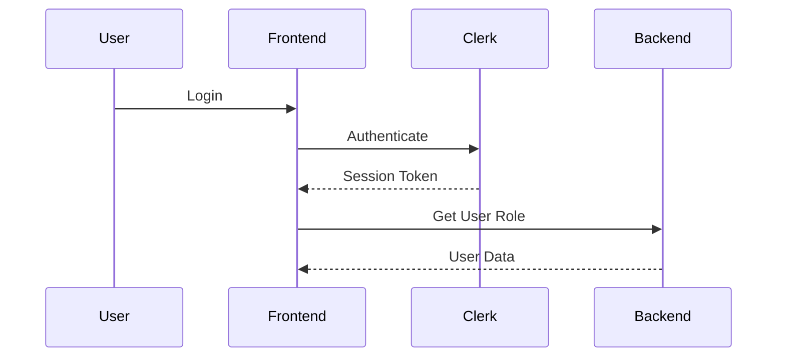

# Documentation

This directory contains comprehensive project documentation organized by category.

## Structure

```
docs/
├── README.md              (this file)
├── integrations/          (third-party service integrations)
│   └── clerk-authentication.md
├── architecture/          (system architecture and flows)
│   └── auth-flow.md
└── guides/                (development guides and best practices)
```

## Documentation Categories

### Integrations (`integrations/`)

Documentation for third-party services and external APIs:
- Authentication providers (Clerk)
- Payment processors
- AI/LLM services (OpenRouter)
- External APIs
- Database connections

**Format:**
- Overview and purpose
- Configuration requirements
- Integration patterns
- API usage examples
- Error handling
- Troubleshooting

### Architecture (`architecture/`)

System architecture, flows, and design decisions:
- Authentication and authorization flows
- Data models and relationships
- Service communication patterns
- Caching strategies
- State management

**Format:**
- Architecture diagrams
- Sequence diagrams
- Data flow diagrams
- Design decisions and rationale

### Guides (`guides/`)

Development guides and best practices:
- Setup instructions
- Coding conventions
- Testing strategies
- Deployment procedures
- Troubleshooting guides

## Documentation Standards

### File Naming

- Use kebab-case: `clerk-authentication.md`
- Be specific: `auth-flow.md` not `flow.md`
- Version if needed: `api-v1.md`, `api-v2.md`

### Content Structure

Each integration/architecture doc should include:

1. **Overview**: What it is and why we use it
2. **Configuration**: Environment variables and setup
3. **Usage**: Code examples and patterns
4. **Integration Points**: How it connects to other systems
5. **Error Handling**: Common errors and solutions
6. **References**: Links to official docs, related docs

### Diagrams

Use Mermaid for diagrams when possible:

```markdown

```

### Code Examples

Include real examples from the codebase:

```typescript
// Reference actual file locations
// From: apps/frontend/src/lib/clerk.ts
export async function initializeClerk(): Promise<void> {
  // ...
}
```

## Documentation Lifecycle

1. **Creation**: Created during story implementation (required by Definition of Done)
2. **Review**: Reviewed during code review
3. **Update**: Updated when implementation changes
4. **Archive**: Old versions moved to `archive/` when superseded

## Cross-References

- User Stories: `.sdlc-workflow/stories/`
- Tasks: `.claude/tasks/`
- Code: `apps/`
- Skills: `.claude/skills/`

---

**Last Updated:** 2025-11-06
**Version:** 1.0
